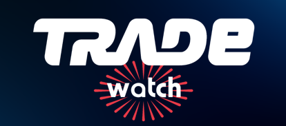
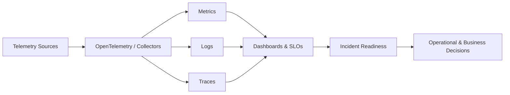

# Arthur Santos

 

---

## 👋 About me

I am a **Senior Monitoring & Observability Specialist** and currently the **Trade Watch Platform Solution Architect** at **Grupo Trade Technology**.

My work focuses on designing and evolving observability architectures for critical environments, connecting **metrics, logs, traces, APM, SRE practices and operational telemetry** to improve reliability, incident response and business decision-making.

> 🇧🇷 Atuo na arquitetura e evolução da **Trade Watch Platform**, uma solução de observabilidade voltada para monitoramento, APM, visibilidade operacional, prontidão para incidentes e correlação de sinais técnicos com impacto de negócio.

---

## 🚀 Current position

<table>
  <tr>
    <td width="70%">
      <h3>Trade Watch Platform Solution Architect</h3>
      

        Leading the architecture and technical evolution of an observability platform focused on critical IT environments, combining infrastructure monitoring, application performance monitoring, distributed tracing, logs, metrics and operational dashboards.
      

      

        The goal is to transform technical signals into actionable insights for engineering, operations and executive decision-making.
      

    </td>
    <td align="center" width="30%">
      
        
      
    </td>
  </tr>
</table>

---

## 🎯 Focus areas

- **Observability Architecture** for critical environments
- **APM strategy and implementation**
- **Distributed tracing** with OpenTelemetry-based pipelines
- **Metrics, logs and traces correlation**
- **SRE practices**, SLI/SLO and reliability engineering
- **Incident readiness** and operational visibility
- **Monitoring automation** with Python and Ansible
- **Multi-tenant observability platforms**
- **Executive and technical dashboards** for decision support

---

## 🧭 Core capabilities

| Area | What I work on |
|---|---|
| **Observability Architecture** | Telemetry strategy, platform design, multi-tenant architecture and governance |
| **Monitoring** | Infrastructure, services, applications, integrations and business-oriented monitoring |
| **APM** | Application performance, service maps, traces, bottlenecks and root cause analysis |
| **SRE** | Reliability, SLI/SLO, incident readiness, service health and operational maturity |
| **Automation** | Python, Ansible, integrations, repeatable workflows and operational efficiency |
| **Platform Engineering** | Standards, scalability, observability as a platform and internal enablement |

---

## 🛠️ Core stack

### Observability, Monitoring & APM

<table>
  <tr>
    <td align="center" width="120">
      
       <strong>OpenTelemetry</strong>
       Telemetry
    </td>
    <td align="center" width="120">
      
       <strong>IBM Instana</strong>
       APM
    </td>
    <td align="center" width="120">
      
       <strong>Datadog</strong>
       APM / Observability
    </td>
    <td align="center" width="120">
      
       <strong>Zabbix</strong>
       Monitoring
    </td>
    <td align="center" width="120">
      
       <strong>Prometheus</strong>
       Metrics
    </td>
    <td align="center" width="120">
      
       <strong>Grafana</strong>
       Dashboards
    </td>
  </tr>
</table>

### Grafana LGTM Stack

<table>
  <tr>
    <td align="center" width="140">
      
       <strong>Loki</strong>
       Logs
    </td>
    <td align="center" width="140">
      
       <strong>Grafana</strong>
       Visualization
    </td>
    <td align="center" width="140">
      
       <strong>Tempo</strong>
       Traces
    </td>
    <td align="center" width="140">
      
       <strong>Mimir</strong>
       Metrics backend
    </td>
  </tr>
</table>

### Automation & Engineering

<table>
  <tr>
    <td align="center" width="120">
      
       <strong>Python</strong>
       Automation
    </td>
    <td align="center" width="120">
      
       <strong>Ansible</strong>
       Configuration
    </td>
    <td align="center" width="120">
      
       <strong>Linux</strong>
       Operations
    </td>
    <td align="center" width="120">
      
       <strong>Docker</strong>
       Containers
    </td>
    <td align="center" width="120">
      
       <strong>CI/CD</strong>
       Pipelines
    </td>
  </tr>
</table>

### Cloud, Containers & Infrastructure

<table>
  <tr>
    <td align="center" width="120">
      
       <strong>AWS</strong>
       Cloud
    </td>
    <td align="center" width="120">
      
       <strong>Azure</strong>
       Cloud
    </td>
    <td align="center" width="120">
      
       <strong>GCP</strong>
       Cloud
    </td>
    <td align="center" width="120">
      
       <strong>Kubernetes</strong>
       Orchestration
    </td>
    <td align="center" width="120">
      
       <strong>Terraform</strong>
       IaC
    </td>
  </tr>
</table>

---

## 🧩 Observability mindset

---

## 💡 How I create impact

- I transform complex technical signals into **clear operational decisions**.
- I design observability architectures focused on **reliability, scalability and governance**.
- I connect **infrastructure, application and business telemetry**.
- I support technical and executive decision-making with **actionable operational data**.
- I combine **architectural vision** with **hands-on technical execution**.

---

## 📌 Selected experience

> Use this section only for public-safe references. Remove or adjust client names if there are confidentiality restrictions.

- **Rede de Farmácias São João** — monitoring and observability initiatives with Zabbix and operational visibility.
- **Vale** — monitoring initiatives with Zabbix in critical environments.
- **Major Positivo S+ accounts** — APM-based initiatives and observability practices.

---

## 🎓 Education

**Sistemas para Internet** — Ulbra

---

## 📜 Certifications

Currently updating this section with relevant certifications in observability, monitoring, cloud and SRE.

Recommended structure:

- IBM Instana / IBM Technology certifications
- Zabbix certifications
- Grafana / OpenTelemetry certifications
- Cloud and Kubernetes certifications
- SRE / Reliability Engineering credentials

---

## 🏆 Talks, articles and community

Currently updating this section with public contributions, talks and technical content.

Suggested future items:

- Observability talks and technical presentations
- Articles about monitoring, APM, OpenTelemetry and SRE
- Community participation in Grafana, OpenTelemetry, Zabbix and CNCF ecosystems

---

## 📊 GitHub insights

---

## 🤝 Let's connect

- LinkedIn: https://www.linkedin.com/in/arthur-silva-dos-santos/
- E-mail: ti.arthursantos@gmail.com

---

<strong>Arthur Santos</strong> • Brazil 🇧🇷  
Monitoring • Observability • APM • SRE • Trade Watch Platform

